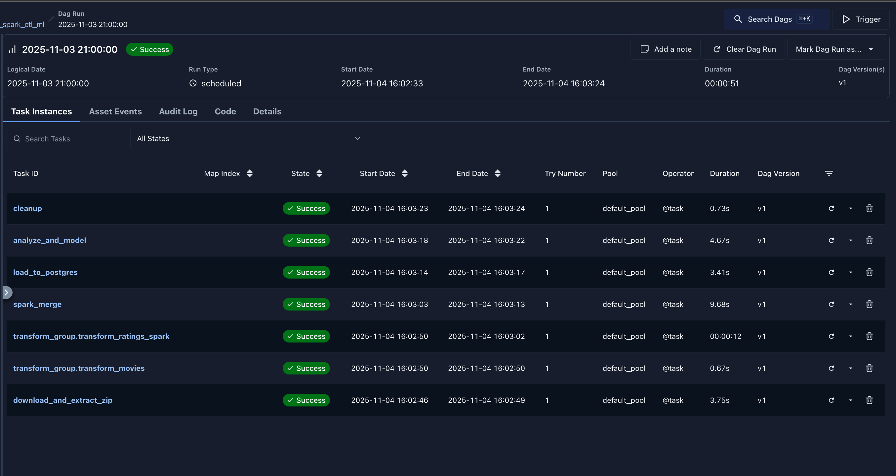
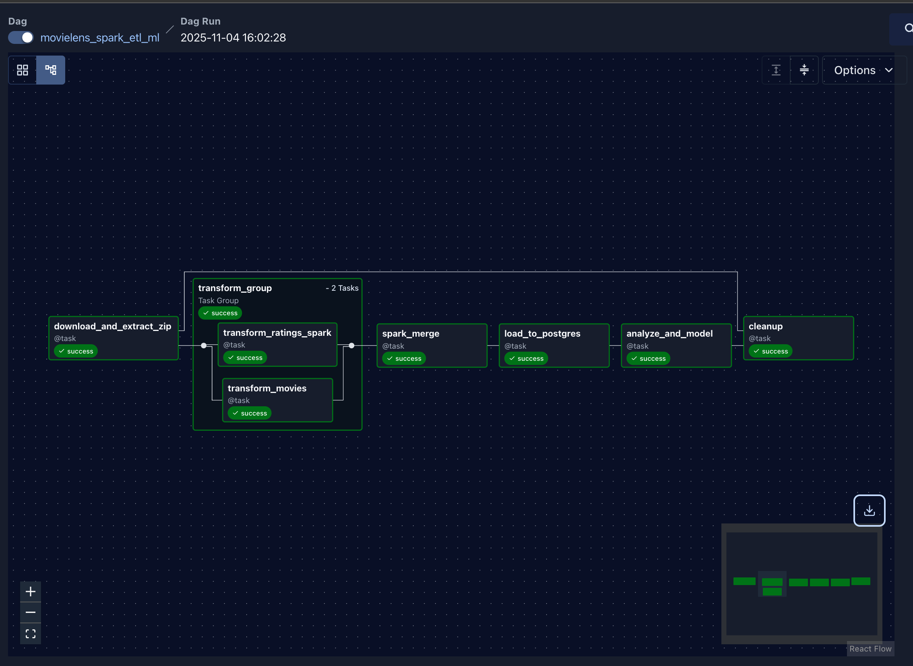

# 🎬 MovieLens End-to-End ETL & Analysis Pipeline


**Author:** Ogechukwu Ezenwa  
**Date:** November 4, 2025  
**Course:** IDS 706 – Data Engineering Systems  
**Assignment:** Data Orchestration with Airflow
---

## Table of Contents
- [Project Overview](#project-overview)
- [Dataset Information](#dataset-information)
- [Project Structure](#project-struture)
- [Pipeline Stages](#pipeline-stages)
- [Setup & Run](#setup--run)
  - [1. Clone the Repository](#1-clone-the-repository)
  - [2. Build and Start Services](#2-build-and-start-services)
  - [3. Access the Airflow Web UI](#3-access-the-airflow-web-ui)
  - [4. Trigger the DAG](#4-trigger-the-dag)
- [Screenshots](#screenshots)
- [Results](#results)


## Project Overview
This project implements a complete **data engineering pipeline** using **Apache Airflow**.  
It automates the ingestion, transformation, merging, loading, and analysis of the **MovieLens** dataset.  
The pipeline demonstrates orchestration, task parallelism, database integration, and lightweight machine learning in an Airflow DAG.

**Goal:**  
To build a reproducible workflow that prepares movie and rating data for analytical modeling while showcasing best practices in modern ETL pipeline design.

- **Parallel Transformations** with an Airflow **TaskGroup**
- **Merging** related datasets (`movies.csv` + `ratings.csv`)
- **PostgreSQL Integration** for warehousing and analysis
- **Machine Learning** (predict average rating from year + genres)
- **Artifacts** (plot + metrics) and **automated cleanup**
- Only **file paths** passed via XCom (no large payloads)

---

## Dataset Information

**Source:**  
[MovieLens Small Dataset (GroupLens)](https://files.grouplens.org/datasets/movielens/ml-latest-small.zip)

**Files Used**
- `movies.csv` — `movieId`, `title`, `genres`
- `ratings.csv` — `userId`, `movieId`, `rating`, `timestamp`

**Join Key**  
`movieId`

## Project Struture
```bash
.
├── config
│   └── airflow.cfg                          # configuration setting for apache airflow
├── dag_success                              # expected output when dag run successfully
│   ├── dag_Airflow_UI.png
│   ├── dag_graph.png
│   └── movielens_spark_etl_ml-graph.png
├── dags/
│   └── movielens_end_to_end_parallel.py     # Main DAG file
├── data/
│   ├── raw/                                 # Raw MovieLens data
│   ├── tmp/                                 # Intermediate parquet files
│   ├── processed/                           # Final merged datasets
│   └── artifacts/                           # Model outputs & plots
├── .devcontainer/
│   ├── docker-compose.yml                   # Container orchestration setup
│   └── .Dockerfile                          # Custom Airflow image
├── plugins/                                 # (Optional) custom Airflow plugins
├── logs/                                    # Airflow logs
├── requirements.txt                         # packages to install
└── README.md

    
```
## Pipeline Stages

| Stage | Description | Tool/Method |
|---|---|---|
| **1. Ingest** | Download & extract MovieLens zip to `data/raw/<ds_nodash>/`. | `requests`, Airflow `@task` |
| **2. Transform (Parallel)** | Two branches run concurrently under a `TaskGroup`: <br>• **Movies (pandas):** extract `year` from title, one-hot top genres → `data/tmp/movies_clean.parquet` <br>• **Ratings (PySpark):** filter 0.5–5.0, drop `timestamp`, aggregate per movie (`n_ratings`, `rating_mean`) → `data/tmp/ratings_clean.parquet` | **pandas** (movies), **PySpark** (ratings), Airflow `TaskGroup` |
| **3. Merge (Spark) & Load** | Spark joins movies + ratings on `movieId`, writes `data/processed/merged_<ds>.parquet`; pandas reads that and loads table **`movies_features`** into Postgres. | **PySpark** (merge), **pandas + SQLAlchemy + psycopg2** (load) |
| **4. Analyze** | Read `movies_features` from Postgres; train **LinearRegression** to predict `rating_mean` from `year` + genre dummies; save plot & metrics. | `scikit-learn`, `matplotlib` |
| **5. Cleanup** | Remove extracted raw folder and any `.parquet` in `data/tmp/`; keep processed data & artifacts. | `shutil`, Airflow `@task` |

## Setup & Run

### 1. Clone the repository
```bash
cd <directory>
git clone git@github.com:Gechyb/IDS706_DE_Wk10_Airflow_pipeline.git
```

**Technologies Used**
- **Apache Airflow** – Orchestration and scheduling  
- **PostgreSQL** – Data storage backend  
- **Docker Compose** – Containerized environment  
- **pandas / pyspark / scikit-learn** – Data wrangling and ML analysis  
- **SQLAlchemy** – Database connection layer  
- **Celery + Redis** – Parallel task execution 

### 2. Build and start services

```bash
docker compose -f .devcontainer/docker-compose.yml build
docker compose -f .devcontainer/docker-compose.yml up airflow-init
docker compose -f .devcontainer/docker-compose.yml up -d
```
Login into http://localhost:8080/ 
Username:airflow
Password:airflow

### 3. Access the Airflow Web UI

- URL: http://localhost:8080
- Username: airflow
- Password: airflow

### 4. Trigger the DAG

- DAG ID: movielens_end_to_end_parallel
- In the Airflow Web UI:
    1. Unpause the DAG
    2. Trigger it manually
    3. Wait for all tasks to complete (they should turn green ✅)

## Screenshots
Successful DAG Execution

Screenshot of the Grid View showing all green (success) tasks below:



DAG Graph View

Screenshot of the Graph View showing the full workflow below:



## Results

- Successfully processes and loads MovieLens data into PostgreSQL.
- Produces:
    - A merged dataset in data/processed/
    - A scatter plot of predicted vs. actual mean ratings (data/artifacts/predicted_vs_actual.png)
    - A metrics summary file (data/artifacts/metrics.txt)
- Demonstrates:
    - Data ingestion and cleaning
    - Parallel task orchestration
    - Database integration
    - Simple analytical modeling
